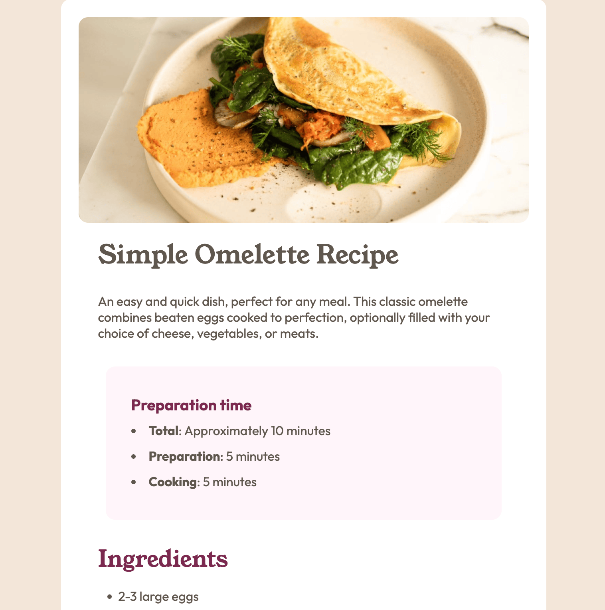

# Frontend Mentor - Recipe page solution

This is a solution to the [Recipe page challenge on Frontend Mentor](https://www.frontendmentor.io/challenges/recipe-page-KiTsR8QQKm). Frontend Mentor challenges help you improve your coding skills by building realistic projects. 

## Table of contents

- [Overview](#overview)
  - [The challenge](#the-challenge)
  - [Screenshot](#screenshot)
  - [Links](#links)
- [My process](#my-process)
  - [Built with](#built-with)
  - [Continued development](#continued-development)
  - [Useful resources](#useful-resources)
- [Author](#author)

## Overview

### Screenshot

### Links

- Solution URL: [source](https://github/com/fyrfli/recipe-page)
- Live Site URL: [live](https://your-live-site-url.com)

## My process

### Built with

- Semantic HTML5 markup
- CSS custom properties
- Mobile-first workflow

### Continued development

I coded this using vanilla html and css. I will probably re-do this using one of the following:

- [SASS](https://sass-lang.com/)
- [Less](https://lesscss.org/)

### Useful resources

- [Mozille developer documentation](https://developer.mozilla.com) - As usual, I always use the Mozilla documentation to help me remember how to do things.

## Author

- Website - [Camille Frantz (@fyrfli)](https://diaspora.im/@fyrfli)
- Frontend Mentor - [@fyrfli](https://www.frontendmentor.io/profile/fyrfli)
- Twitter - [@fyrfli](https://www.twitter.com/fyrfli)
